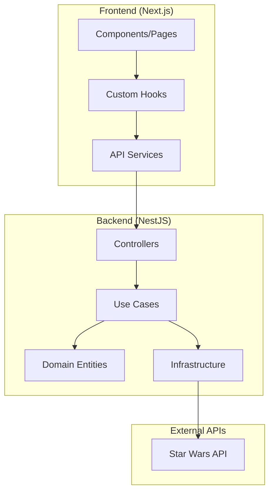

# SWAPI Full Stack Application

URL-Front:[SwapiFront](https://swapi-nextjs-rouge.vercel.app/)
 
URL-Backend:[SwapiBack](https://swapi-nestj-production.up.railway.app/docs)

Una aplicación fullstack que consume la API de Star Wars (SWAPI) proporcionando una interfaz moderna y escalable para explorar el universo de Star Wars.


## 📋 Índice

- [Descripción](#descripción)
- [Arquitectura](#arquitectura)
- [Estructura del Proyecto](#estructura-del-proyecto)
- [Tecnologías](#tecnologías)
- [Instalación](#instalación)
- [Configuración](#configuración)
- [Uso](#uso)
- [API Endpoints](#api-endpoints)
- [Deploy](#deploy)
- [Testing](#testing)
- [Contribución](#contribución)

## 🚀 Descripción

Este proyecto es un wrapper completo de la API de Star Wars que proporciona:

- **Backend API RESTful** con NestJS que actúa como proxy y caché de SWAPI
- **Frontend moderno** con Next.js que consume la API backend
- **Arquitectura limpia** siguiendo principios SOLID y Clean Architecture
- **Caché inteligente** para optimizar rendimiento
- **Containerización** con Docker para fácil deployment
- **Testing comprehensivo** con Jest
- **Documentación API** con Swagger

### Características principales:

- 🎬 **Películas**: Información completa de todas las películas de Star Wars
- 👥 **Personajes**: Detalles de personajes con relaciones
- 🌍 **Planetas**: Información planetaria del universo Star Wars
- 🚀 **Naves**: Especificaciones técnicas de vehículos espaciales
- 💾 **Caché**: Sistema de caché para optimizar consultas
- 🔍 **Paginación**: Navegación eficiente de grandes datasets
- 📱 **Responsive**: Interfaz adaptable a todos los dispositivos

## 🏗️ Arquitectura

El proyecto sigue una arquitectura hexagonal (Clean Architecture) con separación clara de responsabilidades:



## 📁 Estructura del Proyecto

```
swapiFull/
├── Backend/                          # API Backend con NestJS
│   ├── src/
│   │   ├── app/                      # Casos de uso de aplicación
│   │   │   ├── characters/           # Lógica de personajes
│   │   │   ├── movies/               # Lógica de películas
│   │   │   ├── planets/              # Lógica de planetas
│   │   │   └── ships/                # Lógica de naves
│   │   ├── common/                   # Módulos comunes
│   │   │   ├── interceptor/          # Interceptores HTTP
│   │   │   ├── logger/               # Sistema de logging
│   │   │   ├── runtime/              # Configuración runtime
│   │   │   └── swagger/              # Documentación API
│   │   ├── config/                   # Configuración de ambiente
│   │   │   └── enviroments/          # Variables de entorno
│   │   ├── domain/                   # Entidades del dominio
│   │   │   ├── characters/           # Entidad Character
│   │   │   ├── movies/               # Entidad Movie
│   │   │   ├── planets/              # Entidad Planet
│   │   │   └── ships/                # Entidad Ship
│   │   ├── infra/                    # Infraestructura
│   │   │   └── axios/                # Cliente HTTP
│   │   ├── interfaces/               # Interfaces de entrada
│   │   │   └── http/                 # Controladores REST
│   │   └── main.ts                   # Punto de entrada
│   ├── test/                         # Tests unitarios e integración
│   │   ├── e2e/                      # Tests end-to-end
│   │   └── unit/                     # Tests unitarios
│   ├── Dockerfile                    # Imagen Docker del backend
│   └── package.json                  # Dependencias backend
├── Frontend/                         # Cliente web con Next.js
│   ├── src/
│   │   ├── app/                      # Páginas de la aplicación
│   │   │   ├── characters/           # Página de personajes
│   │   │   ├── movies/               # Página de películas
│   │   │   ├── planets/              # Página de planetas
│   │   │   └── ships/                # Página de naves
│   │   ├── assets/                   # Assets estáticos
│   │   │   ├── icons/                # Iconos SVG
│   │   │   └── images/               # Imágenes
│   │   ├── components/               # Componentes reutilizables
│   │   │   ├── layoutComponent/      # Componentes de layout
│   │   │   └── ui/                   # Componentes UI
│   │   ├── config/                   # Configuración frontend
│   │   ├── features/                 # Características por módulo
│   │   │   └── entities/             # Vistas de entidades
│   │   ├── hooks/                    # Custom hooks
│   │   ├── services/                 # Servicios API
│   │   └── styles/                   # Estilos CSS
│   ├── test/                         # Tests del frontend
│   ├── Dockerfile                    # Imagen Docker del frontend
│   └── package.json                  # Dependencias frontend
├── docker-compose.yml                # Orquestación de contenedores
└── README.md                         # Documentación del proyecto
```

## 🛠️ Tecnologías

### Backend

- **NestJS** - Framework Node.js escalable
- **TypeScript** - Tipado estático
- **Axios** - Cliente HTTP
- **Class Validator** - Validación de DTOs
- **Cache Manager** - Sistema de caché
- **Winston** - Logging avanzado
- **Swagger** - Documentación API
- **Jest** - Testing framework
- **Helmet** - Seguridad HTTP
- **Compression** - Compresión de respuestas

### Frontend

- **Next.js 15** - Framework React
- **TypeScript** - Tipado estático
- **Tailwind CSS** - Framework CSS
- **HeroUI** - Componentes UI
- **SWR** - Fetching de datos
- **Zod** - Validación de esquemas
- **Jest** - Testing framework
- **Testing Library** - Utilidades de testing

### DevOps

- **Docker** - Containerización
- **Docker Compose** - Orquestación
- **ESLint** - Linting de código
- **Prettier** - Formateo de código

## 🔧 Instalación

### Prerrequisitos

- Node.js 18 o superior
- Docker y Docker Compose
- Git

### Instalación local

1. **Clonar el repositorio**

   ```bash
   git clone <repository-url>
   cd swapiFull
   ```

2. **Instalar dependencias del backend**

   ```bash
   cd Backend
   npm install
   ```

3. **Instalar dependencias del frontend**

   ```bash
   cd ../Frontend
   npm install
   ```

## ⚙️ Configuración

### Variables de entorno del Backend

Crear un archivo `.env` en el directorio `Backend/`:

```env
# Configuración de la aplicación
APP_PORT=5000
APP_CLUSTER=false
APP_IS_LOCAL_ENVIRONMENT=true
APP_CORS_ALLOW_ORIGIN=*
APP_GLOBAL_PREFIX=api/v1
APP_METHOD=GET,POST,PUT,DELETE,PATCH
APP_LOG_LEVEL=info
APP_LOG_FILE=app.log

# Configuración de SWAPI
STAR_WARS_API_PROTOCOL=https
STAR_WARS_API_DOMAIN=swapi.dev
STAR_WARS_API_PREFIX=api

# Configuración de caché
CACHE_TTL=3600000
CACHE_MAX=100
```

### Variables de entorno del Frontend

Crear un archivo `.env.local` en el directorio `Frontend/`:

```env
NEXT_PUBLIC_API_URL=http://localhost:5000/api/v1
NODE_ENV=development
```

## 🚀 Uso

### Desarrollo local

1. **Iniciar el backend**

   ```bash
   cd Backend
   npm run start:dev
   ```

2. **Iniciar el frontend**

   ```bash
   cd Frontend
   npm run dev
   ```

3. **Acceder a la aplicación**

   - Frontend: http://localhost:3000
   - Backend API: http://localhost:5000/api/v1
   - Swagger Documentation: http://localhost:5000/api/docs

### Usando Docker

1. **Construir y ejecutar con Docker Compose**

   ```bash
   docker-compose up --build
   ```

2. **Acceder a la aplicación**
   - Frontend: http://localhost:3000
   - Backend API: http://localhost:5000/api/v1

## 📡 API Endpoints

### Personajes

- `GET /api/v1/characters` - Listar personajes (paginado)
- `GET /api/v1/characters/:id` - Obtener personaje específico

### Películas

- `GET /api/v1/movies` - Listar películas (paginado)
- `GET /api/v1/movies/:id` - Obtener película específica

### Planetas

- `GET /api/v1/planets` - Listar planetas (paginado)
- `GET /api/v1/planets/:id` - Obtener planeta específico

### Naves

- `GET /api/v1/ships` - Listar naves (paginado)
- `GET /api/v1/ships/:id` - Obtener nave específica

### Parámetros de consulta

- `page`: Número de página (default: 1)

### Ejemplo de respuesta

```json
{
  "count": 82,
  "next": "http://localhost:5000/api/v1/characters?page=2",
  "previous": null,
  "results": [
    {
      "id": "1",
      "name": "Luke Skywalker",
      "height": "172",
      "mass": "77",
      "hair_color": "blond",
      "skin_color": "fair",
      "eye_color": "blue",
      "birth_year": "19BBY",
      "gender": "male",
      "homeworld": "Tatooine",
      "films": ["A New Hope", "The Empire Strikes Back", "Return of the Jedi"],
      "species": ["Human"],
      "vehicles": ["Snowspeeder", "Imperial Speeder Bike"],
      "starships": ["X-wing", "Imperial shuttle"]
    }
  ]
}
```

## 🚀 Deploy

### Deploy con Docker

1. **Construcción de imágenes**

   ```bash
   # Construir imagen del backend
   docker build -t swapi-backend ./Backend

   # Construir imagen del frontend
   docker build -t swapi-frontend ./Frontend
   ```

2. **Deploy con Docker Compose**

   ```bash
   # Crear red compartida
   docker network create shared_network

   # Ejecutar en producción
   docker-compose up -d
   ```

### Deploy en plataformas cloud

#### Heroku

1. **Preparar aplicación**

  ```bash
   # Crear aplicaciones separadas
   heroku create swapi-backend-app
   heroku create swapi-frontend-app
   ```

2. **Configurar variables de entorno**

   ```bash
   # Backend
   heroku config:set NODE_ENV=production -a swapi-backend-app
   
   # Frontend
   heroku config:set NEXT_PUBLIC_API_URL=https://swapi-backend-app.herokuapp.com/api/v1 -a swapi-frontend-app
   ```

#### AWS/Azure/GCP

- Usar **AWS ECS** o **Azure Container Instances** para contenedores
- Configurar **Application Load Balancer** para distribución de tráfico
- Utilizar **AWS RDS** o **Azure Database** para persistencia si es necesario

#### Vercel (Frontend)

```bash
# Instalar Vercel CLI
npm i -g vercel

# Deploy del frontend
cd Frontend
vercel --prod
```

#### Railway/Render (Backend)

1. Conectar repositorio
2. Configurar variables de entorno
3. Deploy automático desde rama principal

### Configuración de producción

1. **Optimizaciones de rendimiento**
   - Habilitar compresión gzip
   - Configurar headers de caché
   - Usar CDN para assets estáticos

2. **Monitoreo y logging**
   - Configurar logging estructurado
   - Implementar health checks
   - Usar herramientas como New Relic o DataDog

3. **Seguridad**
   - Configurar CORS específico
   - Implementar rate limiting
   - Usar HTTPS en producción

## 🧪 Testing

### Backend

```bash
cd Backend

# Tests unitarios
npm run test

# Tests con cobertura
npm run test:cov

# Tests end-to-end
npm run test:e2e

# Tests en modo watch
npm run test:watch
```

### Frontend

```bash
cd Frontend

# Tests unitarios
npm run test

# Tests con cobertura
npm run test:coverage

# Tests en modo watch
npm run test:watch
```

### Ejecutar todos los tests

```bash
# Desde la raíz del proyecto
npm run test:all
```

## 📊 Métricas y Monitoreo

### Logging

- Logs estructurados con Winston
- Rotación automática de archivos
- Diferentes niveles de logging

### Performance

- Caché inteligente con TTL configurable
- Compresión de respuestas
- Paginación eficiente

### Salud del sistema

- Health checks en `/health`
- Métricas de uso de memoria
- Tiempo de respuesta de APIs

## 🤝 Contribución

1. Fork el proyecto
2. Crea una rama para tu feature (`git checkout -b feature/AmazingFeature`)
3. Commit tus cambios (`git commit -m 'Add some AmazingFeature'`)
4. Push a la rama (`git push origin feature/AmazingFeature`)
5. Abre un Pull Request

### Guías de contribución

- Seguir las convenciones de código existentes
- Escribir tests para nuevas funcionalidades
- Actualizar documentación cuando sea necesario
- Usar commits descriptivos

## 📄 Licencia

Este proyecto está bajo la licencia MIT. Ver el archivo `LICENSE` para más detalles.

## 👨‍💻 Autor

**Cristian Damian Vazquez**:

- GitHub: [@cristiancdv](https://github.com/cristiancdv)

---

## 📄 Referencias

- backend: [@nestJs](https://github.com/cristiancdv/Swapi-Nestj.git)
- front:  [@Nextjs](https://github.com/cristiancdv/Swapi-Nextjs)

⭐ Si te gustó este proyecto, no olvides darle una estrella en GitHub!

**¡Que la Fuerza te acompañe!** 🌟
